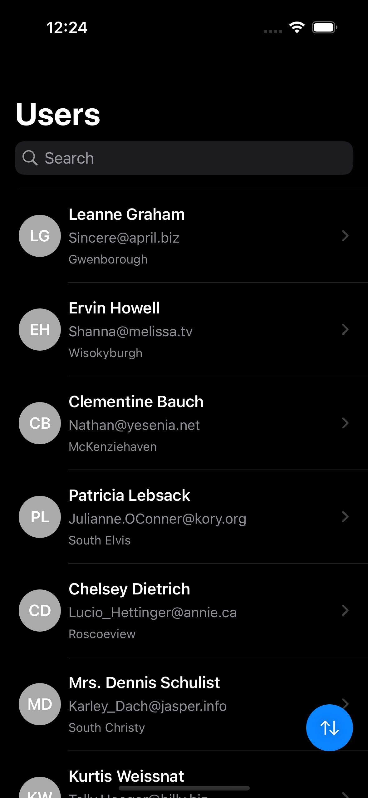
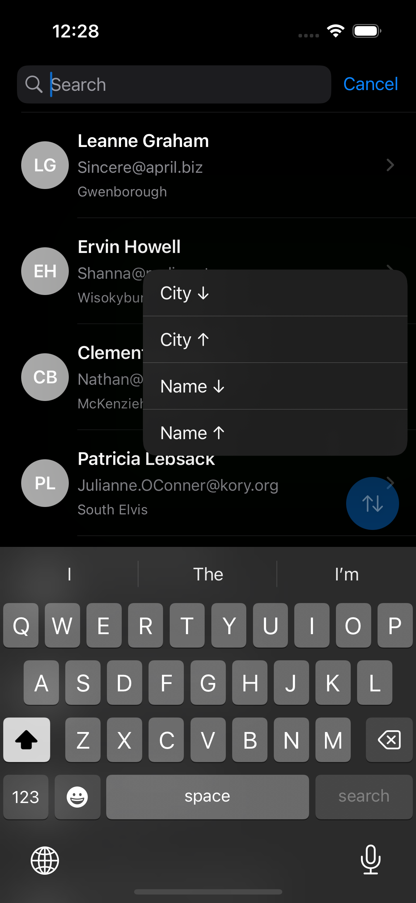
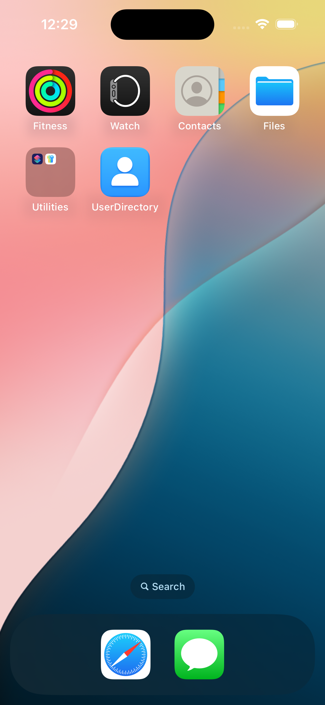
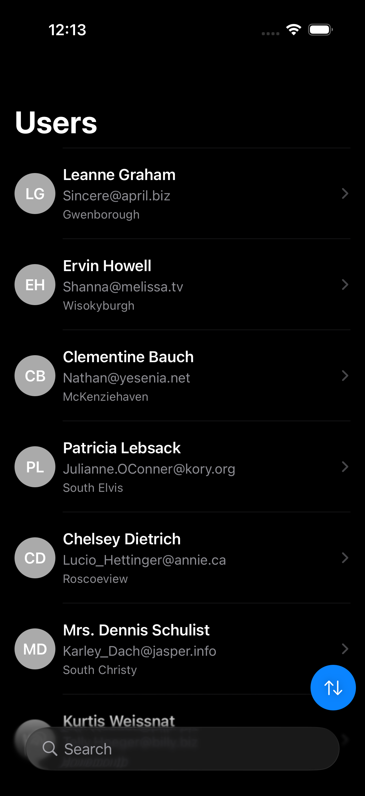
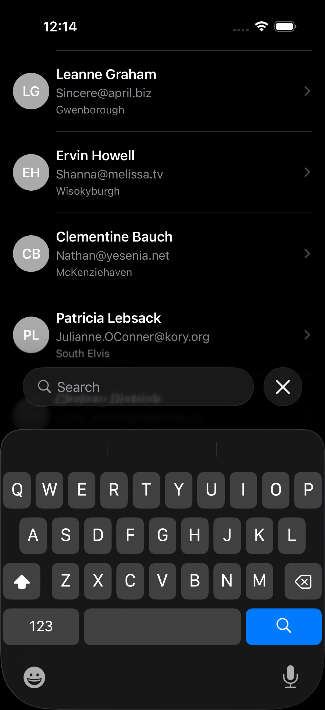
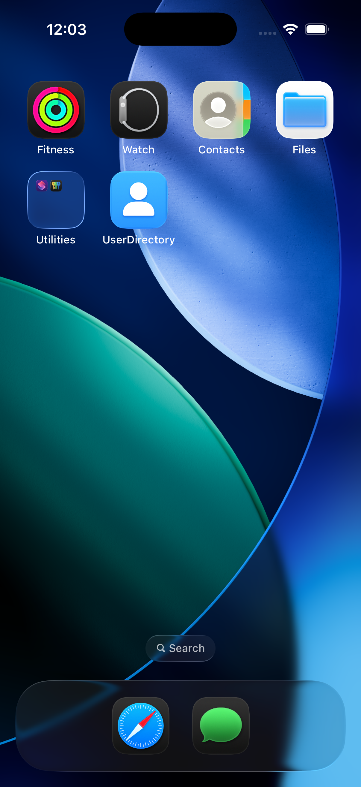

# UserDirectory (Take Home)

A SwiftUI-based iOS User Directory app that lists users from the JSONPlaceholder API. It supports search, sorting, caching, pull-to-refresh, and detailed views. 

The app uses MVVM and is built to be clean, testable, modular, and responsive.
  
## 📱 Compatibility

- **Deployment Target:** iOS 16+
- **Tested On:**
  - iOS 16.5.1
  - iOS 17.5
  - iOS 18.0
  - iOS 26 Beta (June 2025)

The app uses SwiftUI features like `.searchable`, and `.refreshable`, which are all supported from iOS 16+. I also ran this on iOS 26 Developer Beta to confirm future compatibility.
  

## 🛠️ Architecture & Approach

I went with **SwiftUI** and the **MVVM** pattern. Here's why:

- **SwiftUI** streamlines building clean, reactive UIs that respond to state changes. It’s a great fit for modern reactive iOS development and allowed me to build everything in less time without compromising structure or UX.
- **MVVM** helps cleanly separate concerns. The `UserListViewModel` handles fetching, filtering, and sorting. Views just bind to observable data.
- Everything is modular and broken into small, reusable views like `UserRowView`, `UserDetailView`, `LoadingView`, and `ErrorView`.
  

## 📸 Screenshots

iOS 17.5/18.0
<table>
  <tr>
    <td align="center">
      
       User List
    </td>
    <td align="center">
      
       User Detail
    </td>
    <td align="center">
      
       Search
    </td>
    <td align="center">
      
       On the Home Screen
    </td>
  </tr>
</table>

 🆕 iOS 26 (Developer Beta)

<table>
  <tr>
    <td align="center">
      
       User List
    </td>
    <td align="center">
      
       User Detail
    </td>
    <td align="center">
      
       Search
    </td>
    <td align="center">
      
       On the Home Screen
    </td>
  </tr>
</table>

  

## ⚙️ Features

### ✅ User List
- Fetches and displays users with name, email, and city.
- Includes a search bar and filters users by name (case-insensitive).
- Pull to refresh.
- Sort users by name or city (ascending/descending).
- Handles loading state, success, and errors.
  

### ✅ User Details
- Tapping a user shows:
  - Name, email, phone, company, full address.
  - A button to open their website in Safari.
  

### ✅ Offline Support
- Uses `UserDefaults` to cache users.
- If the API call fails, or the user is offline, cached data is shown instead.
  

### ✅ Unit Tests
- Includes unit tests for:
  - Filtering/search logic.
  - UserService fetching.
  - Result validation and edge cases.
  

### ✅ Includes a custom app icon for polish and realism.
  

## 🧪 Testing

- Written using `XCTest`.
- Three tests cover:
  - Search behavior and matching.
  - User ID integrity after filtering.
  - UserService fetch success via real API.
  

## 🛠️ Trade-offs

- I used `UserDefaults` for caching for simplicity and speed, though other options such as `CoreData` would be more scalable for larger datasets.
- There's no pagination since the data received from the API is small, in a real-world scenario I'd implement batch loading or infinite scroll.
- Error handling uses a string-based message approach. For production, a more structured error model would be used.
  

## 📱 Why SwiftUI?

I chose **SwiftUI** over UIKit for this take-home because:

- It enables a much faster build cycle and clean UI code that’s easy to follow.
- It works hand-in-hand with MVVM, allowing state-driven updates via `@StateObject`, `@Published`, etc.
- For a take-home challenge, it helped me stay productive and focused on the architecture and data handling instead of boilerplate layout code, constraints, and autolayout.
  

## 🚀 How to Run

1. Clone the repo.
2. Open `UserDirectory.xcodeproj` in Xcode.
3. Build and run on an iOS 16+ simulator (Xcode 15+) or device.
4. Run tests with ⌘U or via the Test Navigator.
  

## 📂 Folder Structure
UserDirectory
- Models/ # Data models (User, Address, Company)
- Views/ # SwiftUI Views
- ViewModels/ # ViewModel logic
- Services/ # API/Network Logic and service classes (UserService + NetworkManager)
- Persistence/ # Local Caching logic (UserStore)
- Extensions/ # Extensions for Strings and Mock Data
- UserDirectoryTests/ # Unit tests

